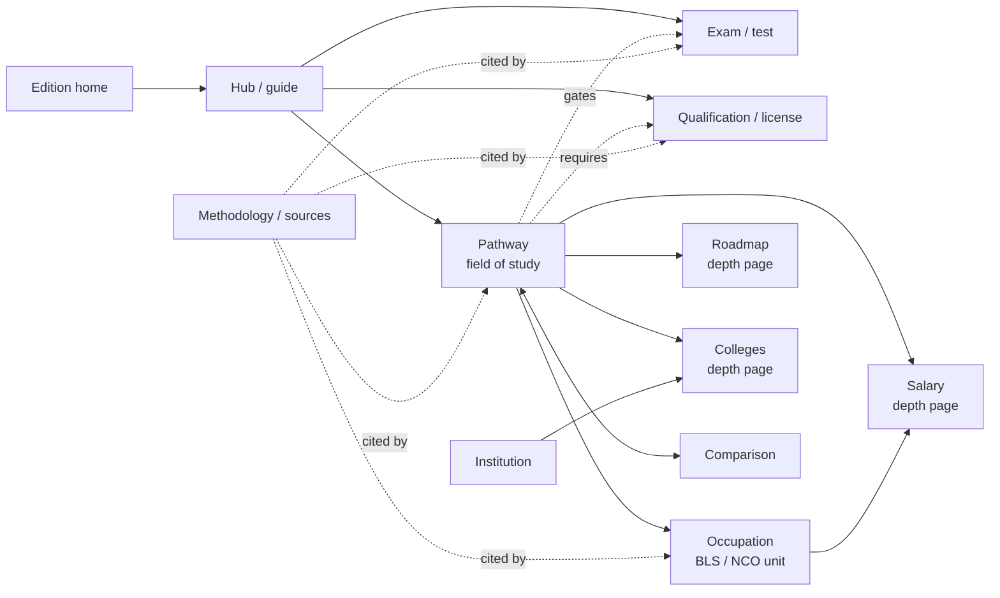
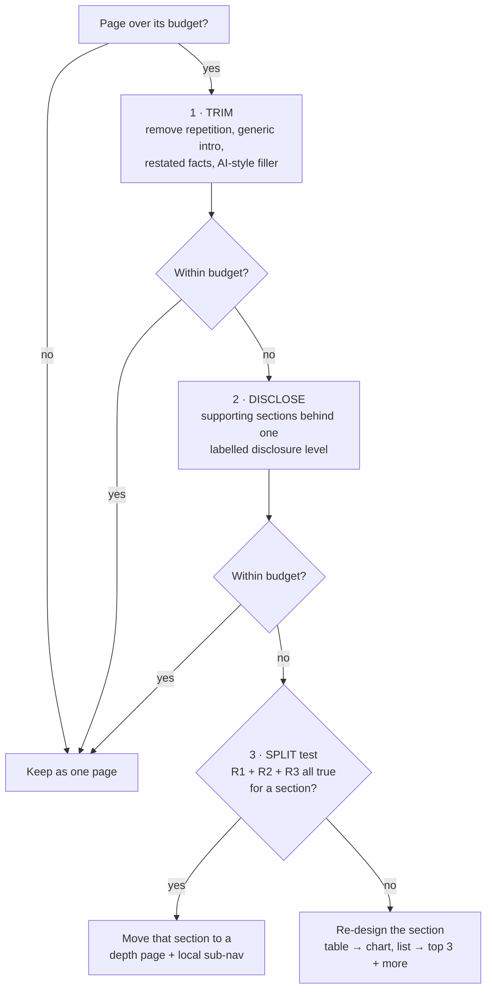
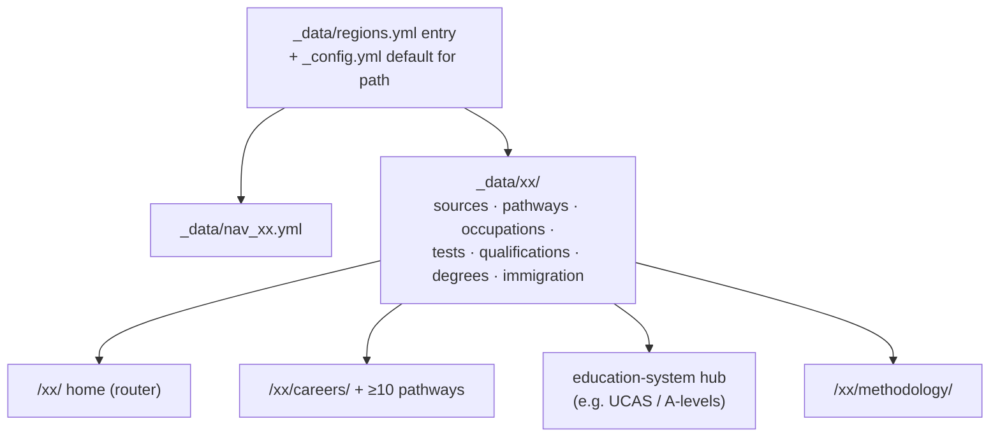

# Phase 3 — Information Architecture

Date: 2026-10-07 · Builds on Phase 1 (audit) and Phase 2 (design system).
Status: **proposal**. No page, URL or navigation changed in this phase. New tool: `scripts/measure-pages.mjs`.

The question this phase answers: *when is a career one page, and when is it several connected pages?*
The answer below is a set of measurable rules, checked against real measurements of all 350 content
pages instead of opinion.

---

## 1. Evidence: how long the pages really are on a phone

`scripts/measure-pages.mjs` opened every rendered page in headless Chrome at 390×844 px (a common
phone) and measured the height of `<main>` in viewport heights ("phone screens" = thumb-scrolls).

| Page type | Pages | Phone screens min / median / max | Median words | Over 6 screens | Over 10 |
|---|---|---|---|---|---|
| India course / career | 122 | 11.8 / 14.3 / 23.4 | 1759 | 122 | 122 |
| India entrance exam | 4 | 6.7 / 7.8 / 7.8 | 1227 | 4 | 0 |
| India global / regional | 22 | 6.6 / 9.8 / 30.5 | 1023 | 22 | 10 |
| India govt exam | 22 | 16.2 / 18.1 / 22.2 | 1464 | 22 | 22 |
| India hub / tool / other | 23 | 0.4 / 6.4 / 12.3 | 1102 | 12 | 5 |
| India roadmap (depth page) | 122 | 2.7 / 3.2 / 4.3 | 534 | 0 | 0 |
| India tables | 8 | 1.1 / 1.1 / 1.1 | 219 | 0 | 0 |
| USA career | 20 | 12.3 / 13.3 / 14.3 | 1206 | 20 | 20 |
| USA hub / home | 7 | 9 / 11.6 / 27.9 | 1493 | 7 | 5 |
| **All** | 350 | 0.4 / 12.1 / 30.5 | | 209 | 184 |

Longest single pages: `study-abroad.html` 30.5 · `us/` 27.9 · `state-pathways.html` 27.5 ·
`study-abroad/usa.html` 24.2 · `us/professional-licenses/` 23.5 · `cma.html` 23.4 · `ssc-cgl.html` 22.2.
No page overflows horizontally at 390 px.

**What this shows**
1. The median content page is **12 phone screens**. 184 pages are over 10.
2. The problem is **not too few URLs**. The 122 India roadmap pages are a natural depth page and
   already sit at a healthy 3 screens. The problem is **flat pages with 13–18 equal-weight sections**.
   Every India course page uses the same 16-section template (quick, what, who, eligibility, roadmap,
   subjects, admission, fees, salary, jobs, higher studies, pros/cons, myths, comparison, related, FAQ).
3. Words are not the issue either: a USA career page has 1,206 words but takes 13.3 screens. Layout
   is (tables, cards with padding, every section given eyebrow + h2 + paragraph).

So the main tool is **trim → disclose → split**, in that order. Splitting comes last.

---

## 2. One global content model

The same entity types serve India, USA and any future country. Today they exist only implicitly
(an India "stream" hub mixes courses, careers and exams).

| Type | India today | USA today | Notes |
|---|---|---|---|
| Edition home | `index.html` | `/us/` | A router, not an encyclopedia. |
| Hub / guide | streams, after-10th/12th, goal hubs, govt-exams | high-school, tests, college, licenses, international | Explains a system and routes to entities. |
| Pathway (field / course) | `cse.html`, `ca.html`, `bcom.html` … | `/us/careers/<slug>/` | The student's unit of decision. |
| Occupation | inside pathway pages | `occupations.yml` (34), shown inside pathways | **No standalone occupation pages** (see rule R7). |
| Exam / test | `jee-main.html`, `ssc-cgl.html` … | inside `/us/tests/` | India exam pages are destinations (people search the exam name). |
| Qualification / license | CA, CMA, CS (as pathways) | 9 in `licenses.yml`, one long page | |
| Roadmap (depth) | `roadmaps/<slug>.html` (122) | inline in each career page | |
| Salary (depth) | — | — (Phase 10) | Only where geographic data exists. |
| Colleges (depth) | finder `colleges.html?…` | — (Phase 11) | Filterable, not per-state pages. |
| Comparison | `career-comparison.html?c=…` tool, `ca-vs-cma-vs-cs` → tool | — | Curated pairs only. |
| Methodology | — | — (per-page source lists) | One page per edition (Phase 7). |

Phase 5+ adds a `page_type` value to new templates (data, not URLs) so search, breadcrumbs, schema
(`Course`, `Occupation`, `EducationalOccupationalCredential`) and the measurement script can use it.
India front matter is **not** bulk-edited for this; India types are derived from the breadcrumb parent,
as the measurement script already does.

---

## 3. Page budgets (measured in phone screens at 390×844)

| Type | Budget | Today (median) |
|---|---|---|
| Edition home | ≤ 5 | India 9.6 · USA 27.9 |
| Hub / guide | ≤ 8 | USA 11.6 · India streams 8.7–10.9 |
| Pathway overview | ≤ 7 (USA) · ≤ 9 (India, content protected) | USA 13.3 · India 14.3 |
| Exam page | ≤ 9 | India govt 18.1 · entrance 7.8 |
| Depth page (roadmap, salary, colleges) | ≤ 6 | roadmaps 3.2 |
| Comparison | ≤ 4 | — |
| Tool / finder | no budget (interactive) | |

A budget is a **trigger for review**, not a reason to cut facts. Going over it starts the procedure in §4.

---

## 4. The rules: one page or a connected hub

### Order of operations

### Split rules — a section gets its own URL only when all three are true
- **R1 Separate intent.** A real person would search for it on its own, with its own wording
  ("software developer salary by state", "how to become a CPA", "SSC CGL syllabus").
- **R2 Its own data or depth.** It is driven by a dataset or filter (states, metros, colleges), or it
  is at least 2 phone screens of content that does not repeat the parent page.
- **R3 It stands alone.** It still makes sense when opened directly from search, with a one-line
  recap and a link back. If it only works as "part 3 of 5", it stays a section.

### Keep-together rules
- **R4 Never split:** FAQ, tips, related links, "who should choose", high-school prep, myths. These get
  trimmed or folded into other sections (tips into roadmap steps, HS prep into step 1).
- **R5 Merge thin pages.** A page with under 1.5 screens of unique content, with a richer sibling or
  parent, becomes a section there, and its URL redirects (`jekyll-redirect-from`). URLs are never
  just deleted. (This is how the old `colleges-*` and `coaching-*` pages were already handled.)
- **R6 One disclosure level.** Inside a page, content can be one click away (`
`, "Show N
  more"), never two (no accordion inside accordion). NN/g: beyond two levels "users often get lost".
  Key facts never sit behind disclosure: Google's mobile-first guidance allows moving content into
  accordions or tabs instead of removing it, but practitioners report that visible content can rank
  better, so answers stay visible and only supporting detail is collapsed.

### Scope rules
- **R7 No standalone occupation pages.** Occupations live inside pathways and the salary explorer;
  a page per BLS occupation would duplicate BLS and its own pathway page. Revisit only for an
  occupation with no pathway and clear search demand.
- **R8 No per-state / per-metro / per-city pages** unless the place changes more than the numbers
  (for example, state licensing rules with jurisdiction-specific facts). Numbers-only variation → filter.
- **R9 Comparisons:** only curated pairs that students actually decide between, both sides live,
  and at least 5 rows that really differ. URL `/<edition>/compare/<a>-vs-<b>/`.
- **R10 Depth limit:** home → hub → page → depth page. No content deeper than 3 clicks from the
  edition home.

### Every page, always
- **R11** One primary intent, stated in the H1 and the first sentence.
- **R12** "Where am I": breadcrumb mirrors the URL; sub-nav when the page belongs to a hub.
- **R13** "What next": at least two forward links that follow the decision path (pathway → roadmap →
  colleges/exam), not a generic related grid alone.
- **R14** Sources on the number (chip), one methodology page per edition.

---

## 5. USA — applied

### URL map

| URL | Status | Decision | Rule |
|---|---|---|---|
| `/us/` | live, 27.9 screens | **Rebuild as a router (≤ 5):** answer-first intro, 5 entry doors (High school · Tests · College & money · Careers · Licenses · International), compact pathway grid → `/us/careers/`. The education ladder moves to High School / College hubs; FAQ trimmed. | budget, R4 |
| `/us/careers/` | live, 9.7 | Keep. Add category + "license needed" + "typical entry" filters (20 → 100+ pathways). | |
| `/us/careers/<slug>/` | live ×20, 13.3 | **Overview ≤ 7:** answer-first header, roadmap v2 (HS prep + tips folded into steps), top 3 occupations + "show more", work-life bento (3 tasks, context bars), license summary, international note, 3 FAQ, next steps. Pay detail, industries and states **move to `/salary/`**. | trim, R1–R3 |
| `/us/careers/<slug>/salary/` | **new** (Phase 7–10) | 5-number pay range, national → state → metro selector, industries, all occupations. Only for pathways whose lead occupation has OEWS geographic data (19 of 20 today; Medicine has no all-physicians state series → no salary page, national range stays on the overview). | R1 R2 R3, R8 |
| `/us/careers/<slug>/colleges/` | later (Phase 11) | IPEDS programs for that field, filterable. Created only when the data exists. | R1 R2 |
| `/us/tests/` | live, 13.0 | Keep **one page**, trim to ≤ 8 (SAT vs ACT as a compact comparison; AP as a short list + link to College Board). MCAT, LSAT and DAT belong in their pathways and licenses. | R3 fails for sub-tests today |
| `/us/college/`, `/us/high-school/` | live, 11.6 / 11.4 | Keep one page each; trim to ≤ 8; receive the ladder content from `/us/`. | |
| `/us/professional-licenses/` | live, **23.5** | **Split:** hub (≤ 5: who grants licenses, table of 9 with links, changes to watch) + `/us/professional-licenses/<id>/` for medicine, law, CPA, PE, nursing, pharmacy, dentistry, PT, psychology. Each one is a real search intent ("how to become a CPA"), 2–3 screens, and will hold state variation. | R1 R2 R3 |
| `/us/international-students/` | live, 9.0 | Keep the hub (≤ 8). **Split** `/us/international-students/work-authorization/` (OPT, STEM OPT, H-1B) in Phase 13: distinct intent, volatile, needs its own date stamp. | R1 R2 R3 |
| `/us/compare/<a>-vs-<b>/` | **new** (Phase 14) | Start with pairs where both sides are live: `computer-science-vs-software-engineering`, `mechanical-vs-electrical-engineering`, `accounting-vs-finance`, `data-science-vs-computer-science`. **M.D. vs D.O.** lives inside Medicine (both routes lead to one license; it is a section, not a page). Nursing vs PA waits until a PA pathway exists. | R9 |
| `/us/colleges/` | **new** (Phase 11) | One filterable directory (state, type, level, program) on JSON data. No per-state pages (R8). | R8 |
| `/us/methodology/` | **new** (Phase 7) | All sources, data vintages, how numbers are chosen; every source chip links here. | R14 |

### Career hub local navigation (only when depth pages exist)
`Overview · Salary · Colleges` in `md-subnav` under the header; no item for a page that does not exist.
The roadmap stays on the overview for USA (it is short once the HS and tips sections are folded in).

---

## 6. India — applied (URLs frozen, content protected)

India already follows the hub model: **pathway page + roadmap depth page** (122 pairs). What it lacks
is hierarchy inside the pathway page. Phase 15 proposal, shared-template level only:

| Tier | Sections (today's ids) | Treatment |
|---|---|---|
| Primary (always visible) | `quick` (at a glance), `what`, `who`, `eligibility`, `roadmap` | Answer-first header (Phase 2 `md-answer`) with ₹ stat tiles; short path → "See the full journey" (roadmap page) |
| Secondary (visible, compact) | `admission`, `fees`, `salary`, `jobs` / `careers` | Bento + tables; salary as stat tiles + one table |
| Supporting (one disclosure level) | `subjects`, `higher`, `proscons`, myths, comparison, `faq` | Each collapsed with a one-line takeaway in the summary; content and HTML unchanged inside |

Expected effect: about 14 → 8–9 screens with **zero content removed** (to be measured in Phase 15
before it ships). Govt exam pages (18 screens, longest group): syllabus and pattern tables go into
per-paper disclosure; eligibility and salary stay visible.

India IA additions that need no URL change:
- Stream hubs: type badges and a filter (Course · Career · Exam) on the item lists, so the mixed
  lists read as structured.
- Every pathway page gets the R13 "what next" block (roadmap → colleges finder → related exam).
- `study-abroad.html` (30.5) and `state-pathways.html` (27.5) are over budget, but those folders are
  off-limits for automated edits (owner decision). They are flagged here only.

---

## 7. Future country kit (UK, Canada, Australia …)

- **Same content model and templates;** country-specific *slots*, not country-specific CSS.
  Example slots: admissions system, school-leaving exams, licensing regulators, national occupation
  statistics (UK ONS/SOC 2020, Canada NOC + Job Bank, Australia ANZSCO + Jobs and Skills Australia).
  These names are starting points for that country's research phase, not verified facts.
- **Launch minimum:** home, education-system hub, careers hub, 10 pathways, methodology. All data
  with source id + date, checked by a `check-<xx>-data` script like USA's.
- URL prefix = ISO country code (`/uk/`, `/ca/`, `/au/`); India stays at the root (protected URLs).
- No hreflang between editions: they describe different systems, not translations.

---

## 8. Navigation and SEO implications (input for Phases 6, 7, 17)

- Sidebar per edition = hubs only, at most 7 top items; entities are reached through hubs, search and
  in-page links (unchanged principle, now explicit).
- Breadcrumbs mirror URLs: `USA Home › Careers › Computer Science › Salary`.
- Each new depth page: own title/description/canonical; `BreadcrumbList`; the overview links to it
  in the sub-nav and in context ("Salary by state →").
- Merges always leave a redirect (`redirect_from`) and the old URL leaves the sitemap.
- Sitemap generation (Phase 6) uses the page types to include the 122 roadmaps and exclude previews.

## 9. Tool added: `scripts/measure-pages.mjs`

`node scripts/measure-pages.mjs <renderedSiteDir> [out.json]` serves a rendered copy of the site,
opens every page at 390×844 in headless Chrome/Edge (no npm dependencies) and records phone screens,
words, sections, tables, FAQ count and horizontal overflow. It waits for each page to finish loading
before measuring. Use it before and after any template change to prove a page got shorter without
losing content (word count stays the same, screens go down).

---

## 10. Quality gate (Phase 3)

1. **Researched:** real page lengths on a phone for all 350 content pages; section structure of the
   India templates (16 shared section ids across 122 pathway pages); NN/g disclosure depth; Google's
   mobile-first guidance on content in accordions/tabs.
2. **Discovered:** India already has the overview + depth-page model (roadmaps). Length comes from
   flat equal-weight sections, not from missing URLs. The USA home (27.9) and licenses page (23.5)
   are the two clear split cases. The licenses page has 9 separate search intents in one URL.
3. **Changed:** no site pages. Added this document and `scripts/measure-pages.mjs` (excluded from
   the build).
4. **Why:** URL decisions are expensive to reverse (SEO, links), so they are fixed as testable rules
   before any template work.
5. **Files:** `docs/global-platform/PHASE-3-INFORMATION-ARCHITECTURE.md`, `scripts/measure-pages.mjs`.
6. **Could affect:** nothing on the live site (`scripts/` and `docs/` are excluded from Jekyll).
7. **Tested:** the measurement script ran on the full render (351 pages, 0 horizontal overflow).
   The first run missed 2 pages because of navigation timing; fixed by waiting for each URL to reach
   `readyState=complete` (second run: all pages measured, results within ±0.5 screens).
8. **Owner decisions:**
   - Approve the split list: USA home → router; licenses → hub + 9 pages; careers → overview +
     `/salary/`; international → `work-authorization/` subpage later.
   - Approve "no standalone occupation pages" and "no per-state pages" (R7, R8).
   - India Phase 15 tiering (supporting sections collapsed, content unchanged) — OK in principle?
   - The first comparison pairs listed in §5.
9. **Better than the brief:** the brief proposed up to 5 pages per career. The measurements show
   one extra depth page (Salary, and Colleges later) is enough, and India's existing roadmap pages
   prove the pattern. Page budgets in phone screens make "too long" testable.
10. **Before Phase 4:** the data schema must support the new depth pages: national 25th/75th
    percentiles, state and metro OEWS as JSON, `page_type`, per-state licensing facts, comparison
    pair definitions.
