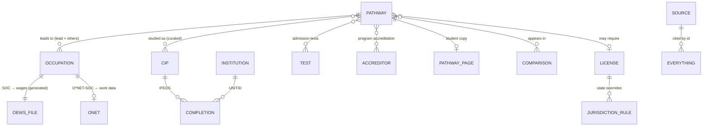

# Phase 4 — Data Architecture

Date: 2026-10-07 · Builds on Phases 1–3. Status: **architecture + working pipelines**.
No site page or data file used by pages changed in this phase.

New tooling (all in `scripts/`, excluded from the Jekyll build, no npm dependencies):
- `scripts/build-oews.mjs` — official BLS OEWS file → wage/employment JSON (national, state, metro).
- `scripts/build-ipeds.mjs` — official NCES IPEDS files → per-pathway college lists.
- `scripts/lib/unzip.mjs` — tiny ZIP / XLSX / CSV reader used by both.

Both pipelines were run end to end and their output checked against figures already on the site.

---

## 1. What the research established (primary sources, checked 2026-10-07)

| Source | Finding | Consequence |
|---|---|---|
| BLS OEWS bulk files, `download.bls.gov/pub/time.series/oe/` | The **whole May 2025 OEWS dataset** is one tab-separated file, `oe.data.0.Current` (331,509,758 bytes, files dated 15 May 2026, release code `2025A01` = "May 2025"), plus `oe.area`, `oe.datatype`, `oe.footnote`. Series id = `OEU` + area type (N/S/M) + 7-digit area + 6-digit industry + 6-digit SOC + 2-digit datatype. | **One download a year gives every number we need**: national, all states, every metro and nonmetro area, all percentiles. No API quota, no thousands of requests. |
| BLS www.bls.gov special-request ZIPs | Return **HTTP 403** to scripts (bot protection), even with browser headers. | Don't scrape around it. Use `download.bls.gov` with an identifying User-Agent (accepted) or the API. |
| BLS Public Data API | v1: 25 queries/day, 25 series/query. v2 (free registration): 500/day, 50 series/query, 50 requests per 10 s. | API stays as a spot-check tool (`fetch-oews.mjs`); the bulk file is the pipeline. |
| BLS OEWS datatypes and footnotes | 01 employment · 04 annual mean · 11–15 annual 10th/25th/median/75th/90th. Footnote 5 = "equal to or greater than $115.00 per hour or $239,200 per year". Footnote 8 = "Estimate not released". | Store percentiles; mark capped values `{value, cap: true}`; never show unreleased values. |
| NCES IPEDS complete data files | `HD2024.zip` (6,072 institutions, 72 fields) and `C2024_A.zip` (307,707 completion rows, July 1 2023 – June 30 2024) download freely. `HD2025` and `C2025_A` are **not released yet** (404). Dictionary: AWLEVEL 3 associate, 5 bachelor's, 7 master's, 17/18/19 doctor's; 12/13/15 are **totals**. | Pipeline uses 2024; it must skip the total codes or every count doubles. |
| NCES CIP 2020 ↔ SOC 2018 crosswalk (`CIP2020_SOC2018_Crosswalk.xlsx`) | 6,097 CIP→SOC rows. Example: SOC 13-2011 (accountants) ← CIP 52.0301 Accounting, 52.0303 Auditing, 52.1601 Taxation …; SOC 17-2141 (mechanical engineers) ← 14.1901, 14.1101, 14.4101. The software-developer SOC maps to dozens of computing CIPs. | The crosswalk **suggests**; each pathway's CIP list is **curated** and checked against it. |
| O\*NET database | Version **31.0** (site updated 6 Oct 2026), free download (Excel/CSV/JSON) without registration: Task Statements, Work Context, Software Skills, Education. Licensed **CC BY 4.0**: attribution to the O\*NET 31.0 Database / U.S. Department of Labor is required. | O\*NET can become a pipeline too (Phase 7+). **Attribution must appear** (methodology page + O\*NET source chips). |
| College Scorecard API (`api.data.gov`) | Works with an API key (DEMO_KEY tested): institution + program (CIP 4-digit) data. | Optional later for costs and outcomes. IPEDS files stay the core because they need no key and are the primary source. |

### Pipeline proof (run on 2026-10-07)

**OEWS** (`node scripts/build-oews.mjs`, streamed, about 5 s): scanned 6,023,971 lines, kept 109,261
values for the 45 SOC codes found in `occupations.yml`, wrote 45 files (2.2 MB total, 27–78 KB each).
Cross-checks against data already on the site:
- Software developers (15-1252), national: employment 1,687,890 · mean $148,100 · 10th $82,460 ·
  25th $105,210 · median $135,980 · 75th $171,980 · 90th $214,670. The same values came from the BLS
  API in Phase 2, and 10th/median/90th match `occupation_details.yml`.
- California: employment 284,390 · median $174,410 · mean $186,770 — identical to the stored top-5
  state row. Coverage: 52 state-level areas, 513 metro/nonmetro areas. Largest metros: New York-Newark-
  Jersey City 121,000; Seattle-Tacoma-Bellevue 92,770; San Jose-Sunnyvale-Santa Clara 87,350 (median $213,110).
- Broad groups 29-1020 (dentists), 29-1210 (physicians), 29-1240 (surgeons): **national only, 0 states,
  0 metros**. This confirms the Phase 6 note that Medicine and Dentistry cannot have a state salary explorer.

**IPEDS** (`node scripts/build-ipeds.mjs --year 2024 …`), first majors, 2023-24:

| Group (CIP) | Institutions | Awards |
|---|---|---|
| computer-science (11.0701) | 986 | bachelor's 44,627 · master's 25,543 · associate 5,645 · research doctorate 1,628 |
| nursing (51.3801) | 1,996 | associate 83,963 · bachelor's 147,345 · master's 20,089 |
| mechanical-engineering (14.1901) | 424 | bachelor's 33,126 · master's 7,287 |
| law (22.0101) | 210 | professional doctorate 39,403 |
| accounting (52.0301) | 1,298 | bachelor's 37,839 · master's 12,493 |
| medicine-md (51.1201) | 149 | professional doctorate 20,668 |

Totals are sums of the IPEDS counts for the listed CIP codes. **Caution confirmed:** IPEDS shows which
institutions award a degree, not whether a program is accredited. Law (210 institutions) is not the same
as the ABA list of approved schools. Accreditation must come only from the accreditor's own list (§5).

---

## 2. Principles

1. **Two kinds of data, kept apart.** *Curated* (researched by hand, YAML in `_data/us/`: pathways, copy,
   licenses, tests, immigration, comparisons) and *generated* (produced by scripts from official files,
   committed as JSON, never hand-edited).
2. **Every value is traceable**: it has `source` (an id in `sources.yml`), a data period, and a verified
   or built date. Generated files carry it in their header; curated rows per record.
3. **Copy, never compute.** Templates show official values. Exceptions, always labelled: sums of
   IPEDS counts across a pathway's CIP codes; the top-N ordering of states.
4. **Codes are the keys.** SOC (BLS), O\*NET-SOC, CIP (NCES), IPEDS UNITID, ISO state codes. Margdarshan
   ids are stable kebab-case slugs (`computer-science`, `cpa`), never renamed once live (they are URLs).
5. **HTML gets the summary, JSON gets the depth.** Liquid reads only small files (national + top 5).
   Full state/metro/college lists are static JSON fetched when a visitor opens a filter.
6. **Volatile facts expire.** Immigration and exam rules carry `review_by`; the checker fails when that
   date has passed.

---

## 3. Entity-relationship model



## 4. File layout (final)

```
_data/us/                      CURATED (YAML) + small GENERATED summaries read by Liquid
  sources.yml                  source registry (existing) + new fields: kind, period, refresh, license
  pathways.yml                 index of all pathways (existing) + new fields below
  pathway_pages.yml            student-facing copy per pathway (existing)
  occupations.yml              BLS OOH headline facts per occupation (existing)
  occupation_details.yml       existing; O*NET parts move to a generated file in Phase 7+
  licenses.yml                 existing + `jurisdictions:` overrides (Phase 12)
  tests.yml  degrees.yml  guides.yml  immigration.yml     existing
  accreditors.yml              NEW — institutional vs programmatic accreditors
  comparisons.yml              NEW — curated pairs (Phase 14)
  oews_summary.json            NEW, GENERATED — per SOC: national 5 percentiles + mean + emp, top 5 states
  colleges_summary.json        NEW, GENERATED — per pathway: institution count, awards by level, top states

assets/data/us/                GENERATED, fetched by the browser only when needed
  oews/<soc>.json              national + all states + all metro/nonmetro areas (27–78 KB raw)
  colleges/<pathway>.json      institutions awarding the pathway's CIP codes
  colleges/<pathway>/<ST>.json state shards when a pathway file exceeds 100 KB (e.g. nursing, 345 KB)
  _meta.json                   release names, build dates, row counts, missing SOCs
```

India keeps its existing data files. The same "source registry + generated vs curated" pattern is the
template for future India data and for any new country (`_data/<cc>/`, `assets/data/<cc>/`).

## 5. Schemas

### 5.1 `sources.yml` → `list.<id>` (extended)
| Field | Type | Req. | Notes |
|---|---|---|---|
| name, publisher, url | string | ✓ | existing |
| accessed | date | ✓ | existing ("checked") |
| kind | `dataset` \| `page` \| `rule` \| `survey` | new | drives the source-chip wording |
| period | string | for datasets | "May 2025", "2025–35", "2023-24" |
| refresh | `annual` \| `quarterly` \| `volatile` | new | volatile ⇒ `review_by` required on the facts that cite it |
| license | string | when required | e.g. "CC BY 4.0 — O*NET 31.0 Database, U.S. DOL/ETA" |
| note | string | | existing (sites that block readers) |

### 5.2 `pathways.yml` → `list[]` (extended; existing fields unchanged)
| Field | Type | Req. | Notes |
|---|---|---|---|
| slug, title, category, lead, occupations, route, license, related, in_page, live | | ✓ | existing |
| cip | list of 6-digit CIP | for colleges page | curated; each code must exist in the NCES crosswalk |
| accreditation | list of accreditor ids | optional | e.g. `[abet-eac]` for engineering; replaces the hard-coded ABET sentence in the template |
| tests | list of test ids | optional | only tests relevant to the pathway (MCAT for medicine, LSAT/GRE for law) |
| depth | `{salary: auto\|off, colleges: auto\|off}` | optional | `auto` = page exists only if the generated data has states / institutions |
| compare | list of comparison ids | optional | |
| page_type | `pathway` | implied | for search, schema and the measure script |

### 5.3 `occupations.yml` (unchanged) + generated OEWS
`occupations.<id>.soc` links to `oews_summary.json[<soc>]` and `assets/data/us/oews/<soc>.json`:
```json
{ "soc": "15-1252", "period": "May 2025", "source": "BLS Occupational Employment and Wage Statistics",
  "national": { "emp": 1687890, "mean": 148100, "p10": 82460, "p25": 105210, "median": 135980, "p75": 171980, "p90": 214670 },
  "states":  { "California": { "emp": 284390, "mean": 186770, "median": 174410, "...": "..." } },
  "metros":  { "0041940": { "name": "San Jose-Sunnyvale-Santa Clara, CA", "emp": 87350, "median": 213110, "...": "..." } } }
```
Display rules: a missing key means "not published by BLS" (shown as such, never estimated); `{value, cap:
true}` is shown as "$239,200 or more"; OEWS employment (establishment survey) and OOH "jobs" (projections
matrix) are different measures and are never mixed in one figure.

### 5.4 `licenses.yml` → `jurisdictions` (Phase 12)
```yaml
cpa:
  # …existing national summary…
  jurisdictions:
    default_note: "Rules differ by state board; confirm with your board."
    overrides:
      - { state: CA, field: education, value: "...", source: cba_ca, verified: 2026-xx-xx }
```
Only states with a verified, sourced difference get a row. No row ⇒ the page says "check your board"
and links NASBA/NCSBN/FSMB/NCEES directories. Never a fake national rule.

### 5.5 `accreditors.yml` (new)
| Field | Notes |
|---|---|
| id, name, url, source | e.g. `abet-eac`, `lcme`, `coca`, `aba`, `aacsb`, `ccne`, `acen`, `acpe`, `coda`, `capte`, `apa-cos` |
| scope | `institutional` \| `programmatic` |
| applies_to | pathway slugs |
| meaning | one sentence: what this accreditation does and does **not** imply (e.g. "required for licensure in most states" vs "a quality signal, not required to work") |
| directory_url | the accreditor's own searchable list: the only allowed basis for marking a program accredited |

Three things are never merged: **institutional accreditation** (a recognized accreditor accredits the
whole school), **program accreditation** (ABET, LCME, COCA, ABA, AACSB …) and **professional eligibility**
(a licensing board's rules, which may require program accreditation). The U.S. Department of Education's
accreditation database is the planned source for institutional status (to be verified in Phase 11).

### 5.6 `comparisons.yml` (new, Phase 14)
```yaml
- id: computer-science-vs-software-engineering
  a: computer-science
  b: software-engineering
  rows:                       # 5–6 rows, each sourced; same: true merges the cells
    - { label: "Focus", a: "...", b: "...", source: ... }
    - { label: "Typical entry", same: true, value: "Bachelor's degree", source: bls_ooh }
  verified: 2026-xx-xx
```
Rule R9: both pathways `live`, at least 5 rows that really differ.

### 5.7 Volatile facts (`immigration.yml`, exam changes)
Every item: `value`, `source`, `verified`, **`review_by`** (default verified + 90 days). The checker fails
after `review_by`, so stale H-1B or OPT rules cannot sit on the site unnoticed.

## 6. Refresh calendar

| Data | Official release rhythm | Margdarshan job |
|---|---|---|
| BLS OEWS | yearly; May 2025 files dated 15 May 2026 | run `build-oews.mjs` each spring; bump `sources.yml → bls_vintage` |
| BLS Employment Projections / OOH | yearly (2025–35 now) | update `occupations.yml` from OOH pages |
| O\*NET | database releases (31.0 on 6 Oct 2026) | refresh tasks/context/tech; keep the CC BY attribution |
| IPEDS HD + C | yearly (2024 available; 2025 not yet) | run `build-ipeds.mjs --year <new>` when HD/C appear |
| USCIS, NCBE, NCEES, NASBA, College Board, ACT | changes any time | `review_by` on every fact; quarterly sweep |

## 7. Validation (checker extensions, built with the pages that use them)

`scripts/check-us-data.mjs` gains: every `pathways.cip` code exists in the CIP crosswalk; every
`accreditation` id exists; every `soc` has an `oews_summary` entry or an explicit `oews: none` reason;
generated files carry `period` and a build date matching `bls_vintage`; `review_by` not in the past;
comparison pairs reference live pathways. Pipelines write `_meta.json` (row counts, missing SOCs) so a
broken download fails loudly instead of producing empty pages.

## 8. Scaling to 100+ pathways

Adding a pathway = one `pathways.yml` entry (occupations, cip, license, tests) + one `pathway_pages.yml`
copy block. Pay, states, metros and colleges then come **automatically** from the pipelines; the
checker refuses incomplete entries. Hand-research is limited to what really needs judgment: the
student-facing copy, the CIP list, licensing and exams. The 34 occupations today cover 45 SOC codes;
100 pathways would mean roughly 150–200 SOC files (≈ 10 MB raw, fetched one at a time) and one
college file per pathway.

---

## 9. Quality gate (Phase 4)

1. **Researched:** the BLS OEWS bulk files, API limits, datatypes and footnotes; IPEDS file availability
   and the award-level dictionary; the NCES CIP–SOC crosswalk; the O\*NET 31.0 download and license;
   College Scorecard API access.
2. **Discovered:** one 331 MB official file replaces thousands of API calls; IPEDS 2025 is not out yet;
   aggregate award codes would double counts; physicians/dentists/surgeons have no state or metro OEWS
   data; O\*NET requires CC BY attribution; IPEDS must never be read as accreditation.
3. **Changed:** added three scripts and this document. No page, template or `_data` file changed.
4. **Why:** the design is proven with real official data before any page depends on it.
5. **Files:** `scripts/build-oews.mjs`, `scripts/build-ipeds.mjs`, `scripts/lib/unzip.mjs`,
   `docs/global-platform/PHASE-4-DATA-ARCHITECTURE.md`.
6. **Could affect:** nothing on the live site (`scripts/` and `docs/` are excluded from the build).
   Pipeline output was written to a scratch folder, not the repo.
7. **Tested:** both pipelines run end to end; OEWS national and California values equal the values
   already published on the site and returned by the BLS API; IPEDS counts are internally consistent
   (first majors only, total codes skipped); `verify-site.mjs` unaffected (no page changes).
8. **Owner decisions:**
   - Approve the static JSON data approach (`assets/data/us/…` fetched on demand). The pipelines are
     ready and Phase 7/10/11 would switch them on.
   - Commit generated files to the repo (simple, works on GitHub Pages) vs a GitHub Action that
     rebuilds them yearly (more automation, more moving parts). Recommendation: commit them and rerun
     locally once a year.
   - Optional: register a free BLS API v2 key for spot checks (not required by the pipeline).
9. **Better than the brief:** the brief assumed API-driven or hand-entered geographic data; the official
   bulk file makes all 50 states and 500+ metro areas available with one download and zero quota. Pay is
   stored as five percentiles, not one "salary".
10. **Before Phase 5:** Phase 5 is the first phase that changes shared CSS/JS used by India pages: tokens,
    card base, `.reveal` fix, external JS, font fallbacks. It needs the full India render diff and
    screenshots before anything is pushed.
